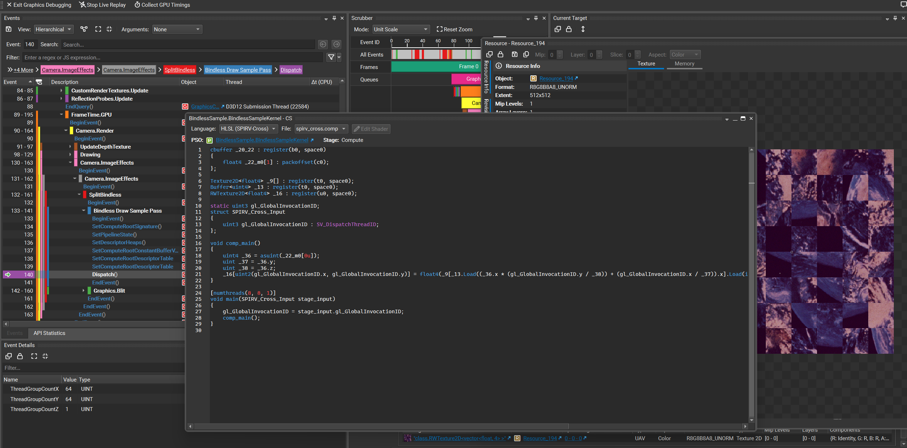

# Unity Bindless Plugin & Sample

本项目提供了一个在Unity中实现Bindless资源的底层插件及配套的使用示例。

## 测试环境

本项目在Unity 6.3.10f1版本下开发(理论上只要unity所用的DXC是1.6及以上的应该都能用)，并在DX12下完成了打包与测试运行。

## 编译依赖

本项目的Unity Shader编译强依赖于以下项目，请确保在编译前先配置好该环境：

- **依赖项目:** [Unity-NextUnityShader](https://github.com/RicciFloOow/Unity-NextUnityShader)
- 关于Shader编译相关的具体参考和环境配置，请直接查阅上述依赖项目中的说明。

## 示例场景使用说明

示例场景主要展示了如何将纹理注册到Bindless Heap中并在CS中进行采样。

1. 在Unity中打开提供的示例场景并进入Play模式。
2. 在运行期间，按下键盘上的 R 键即可实时打乱并随机重新渲染屏幕上的纹理块。  

## 注意事项与已知问题

- **编辑器首次注入延迟:**

  在Unity编辑器中首次添加本插件的DLL时，插件无法正常生效（因为首次注入时机错误）。

  - **解决方法：** 重启一次Unity项目，之后就都可以正常生效了。

- **NSight Graphics 抓帧回放 Bug:**

  在使用部分版本的NVIDIA NSight Graphics进行抓帧时，包含Bindless资源的Live回放会失败（疑似Nvidia自己的问题，用老的Frame Debugger抓帧是正常的）。

  - **解决方法：** 换成新一点的版本就修复了，例如使用NSight 2025.5.0即可正常回放。

  